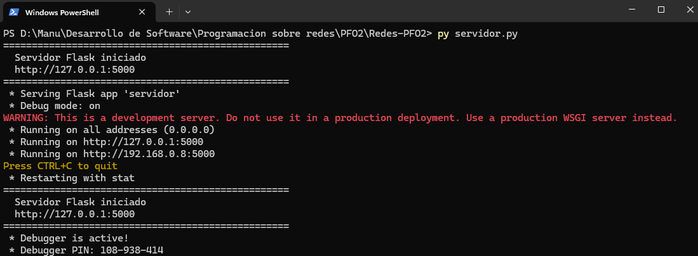
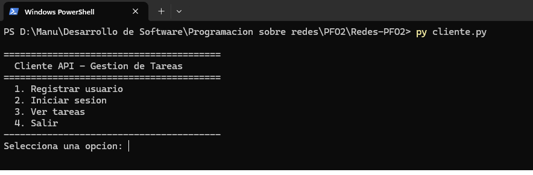
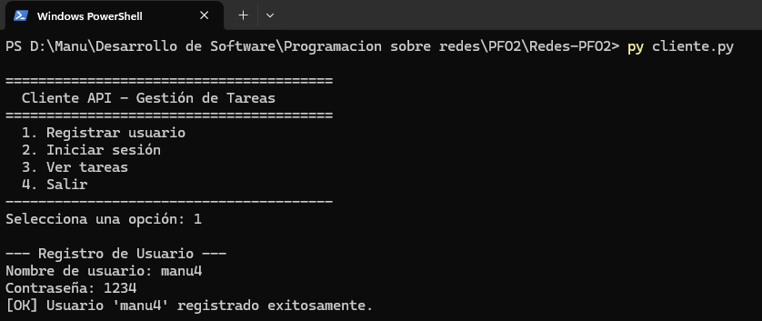
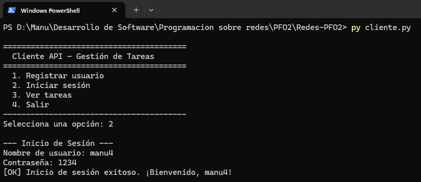
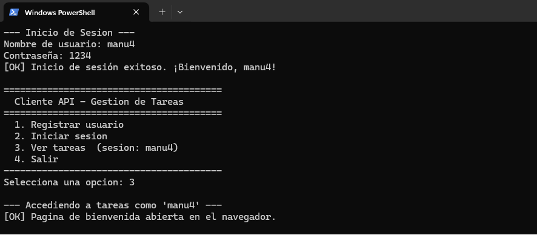
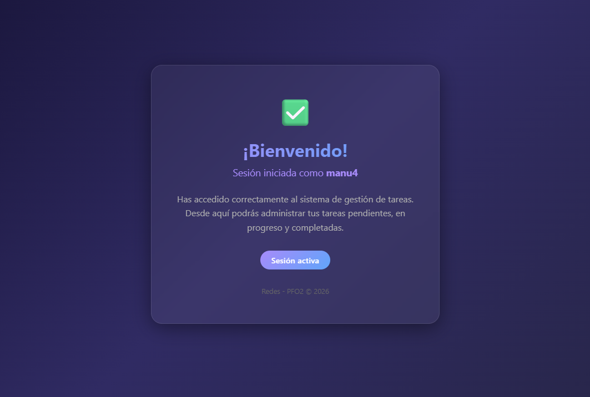
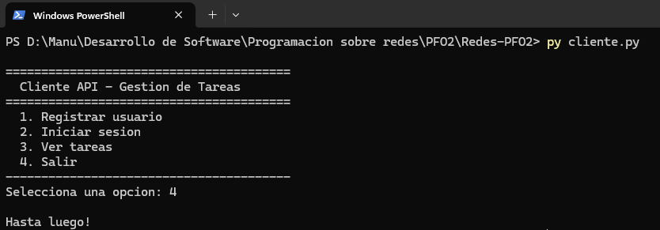

# Redes - PFO2: API REST con Flask y SQLite

API REST desarrollada con **Flask** para gestión de usuarios y tareas, con persistencia en **SQLite** y contraseñas protegidas mediante **hashing**.

**Documentación online:** [https://jmgasbarro.github.io/Redes-PFO2/](https://jmgasbarro.github.io/Redes-PFO2/)

---

## Estructura del Proyecto

```
Redes-PFO2/
├── servidor.py          # API Flask (servidor)
├── cliente.py           # Cliente de consola
├── requirements.txt     # Dependencias
├── templates/
│   └── tareas.html      # Página HTML de bienvenida
├── usuarios.db          # Base de datos SQLite (se crea al ejecutar)
└── README.md            # Este archivo
```

---

## Requisitos Previos

- **Python 3.8+** instalado
- **pip** (gestor de paquetes de Python)

---

## Instrucciones de Ejecución

### 1. Clonar el repositorio

```bash
git clone https://github.com/jmgasbarro/Redes-PFO2.git
cd Redes-PFO2
```

### 2. Instalar dependencias

```bash
pip install -r requirements.txt
```

### 3. Iniciar el servidor

```bash
py servidor.py
```

El servidor se ejecutará en `http://localhost:5000`.

### 4. Ejecutar el cliente (en otra terminal)

```bash
py cliente.py
```

---

## Endpoints de la API

| Método | Ruta        | Descripción                              | Autenticación      |
|--------|-------------|------------------------------------------|---------------------|
| POST   | `/registro` | Registra un nuevo usuario                | No requerida        |
| POST   | `/login`    | Verifica credenciales                    | No requerida        |
| GET    | `/tareas`   | Muestra página HTML de bienvenida        | HTTP Basic Auth     |

### Ejemplos con `curl`

**Registrar un usuario:**

```bash
curl -X POST http://localhost:5000/registro \
  -H "Content-Type: application/json" \
  -d '{"usuario": "manu4", "contraseña": "1234"}'
```

**Iniciar sesión:**

```bash
curl -X POST http://localhost:5000/login \
  -H "Content-Type: application/json" \
  -d '{"usuario": "manu4", "contraseña": "1234"}'
```

**Ver tareas (con autenticación):**

```bash
curl -u manu4:1234 http://localhost:5000/tareas
```

---

## Pruebas con el Cliente de Consola
Al ejecutar `servidor.py`, se presenta un menú interactivo:





Al ejecutar `cliente.py`, se presenta un menú interactivo:





1. **Opción 1**: Registra un nuevo usuario proporcionando nombre y contraseña.

2. **Opción 2**: Verifica credenciales enviando un POST a `/login`.

3. **Opción 3**: Accede a `/tareas` usando HTTP Basic Auth y muestra el HTML.


**Al elegir la opción 3, se accede a la página HTML con el cartel de BIENVENIDO y las tareas cargadas**


4. **Opción 4**: Sale del programa.


---

## Respuestas Conceptuales

### ¿Por qué hashear contraseñas?

El **hashing** de contraseñas es una práctica fundamental de seguridad que transforma la contraseña original en una cadena irreversible de caracteres. Las razones principales son:

1. **Protección ante filtraciones**: Si un atacante accede a la base de datos, no podrá leer las contraseñas originales, ya que solo encontrará los hashes.
2. **Irreversibilidad**: A diferencia del cifrado, el hashing es una función de un solo sentido. No existe una forma práctica de revertir un hash a la contraseña original.
3. **Salting automático**: Bibliotecas como `Werkzeug` agregan un **salt** (cadena aleatoria) al hash, lo que hace que dos usuarios con la misma contraseña tengan hashes diferentes, protegiendo contra ataques de tablas rainbow.
4. **Cumplimiento normativo**: Almacenar contraseñas en texto plano viola buenas prácticas y regulaciones de protección de datos.

En este proyecto se usa `werkzeug.security.generate_password_hash()` que implementa el algoritmo **scrypt** (por defecto) con salt aleatorio.

### Ventajas de usar SQLite en este proyecto

1. **Sin servidor externo**: SQLite es una base de datos embebida que se almacena en un solo archivo (`usuarios.db`). No requiere instalar ni configurar un servidor de base de datos como MySQL o PostgreSQL.
2. **Cero configuración**: No se necesitan credenciales, puertos ni servicios en segundo plano. Solo se necesita Python.
3. **Portabilidad**: El archivo `.db` se puede copiar, mover o respaldar fácilmente. Todo el proyecto es autocontenido.
4. **Ideal para proyectos académicos y prototipos**: Para aplicaciones con pocos usuarios concurrentes, SQLite ofrece rendimiento más que suficiente sin la complejidad de una base de datos cliente-servidor.
5. **Integración nativa con Python**: El módulo `sqlite3` viene incluido en la biblioteca estándar de Python, por lo que no se necesitan dependencias adicionales para la base de datos.

---

## Tecnologías Utilizadas

- **Python 3** — Lenguaje de programación
- **Flask** — Framework web para la API REST
- **Werkzeug** — Hashing seguro de contraseñas (`generate_password_hash` / `check_password_hash`)
- **SQLite** — Base de datos relacional embebida
- **requests** — Biblioteca HTTP para el cliente de consola
